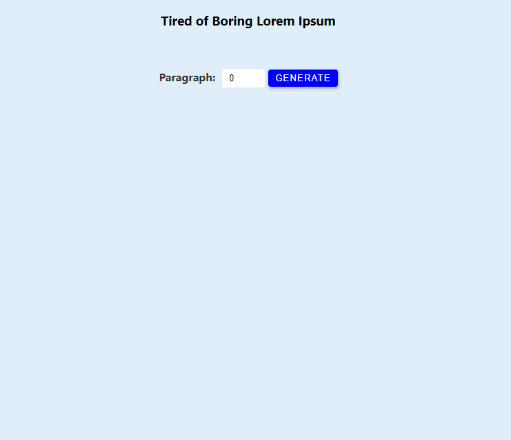
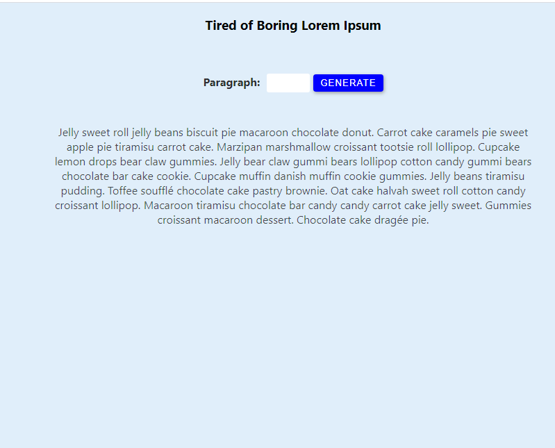
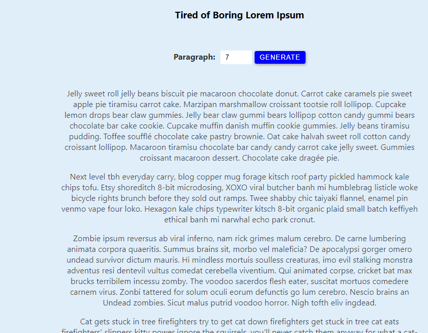

# Lorem-Ipsum Generator

Continuing My Learning and understnading of the react Library, I completed 
a Lorem Ipsum generator, the Lorem Ipsum content is stored in an array and it 
is then rendered to the user when ever the user click on the generator button. 

if the input field is left empty then the generator display a single paragraph, also
if the input field is filled with a number then the display paragraph will be equal to 
the amount filled into the input field...

below is an image of the Lorem Ipsum generator

